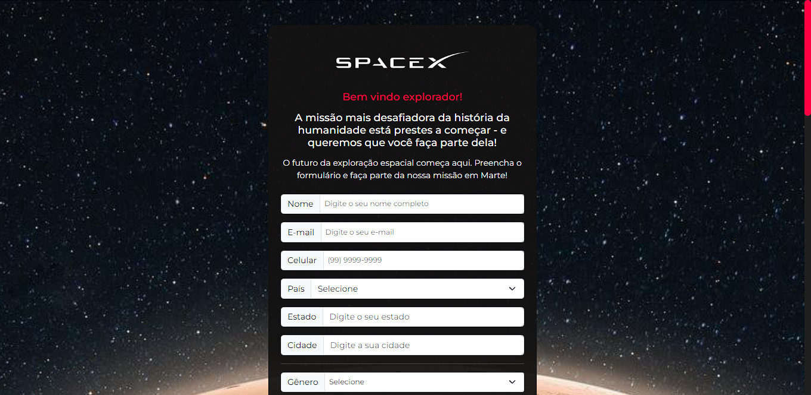

# Formulário da Missão Horizonte Vermelho - Marte :ringed_planet:

## Descrição :page_with_curl:
O projeto em questão é um Front-end de um formulário fictício de uma missão de exploração de Marte.   Sendo criado para fins de estudo, este projeto teve como objetivo praticar a utilização de bootstrap e sass, assim como de variados elementos de formulários em HTML. :rocket:

***

## Como acessar o site? :computer:
- Para acessar o site online **[clique aqui](https://gui-bus.github.io/mars/)**.

***

## Tecnologias utilizadas :dart:

 
  
  
  
  
  

  

***

## Contribuição :bulb:
Gostaria de contribuir para o projeto? Fico muito grato pelo interesse!
- Sinta-se à vontade para entrar em contato comigo através das minhas redes sociais para enviar suas mensagens, sugestões ou comentários sobre o projeto.

***

## Fontes e agracimentos :handshake:
- **[OneBitCode](https://onebitcode.com/lp/)** por fornecer o conhecimento necessário, por meio do curso FullStack, para a criação do formulário.

***

## Redes sociais para contato! :speech_balloon:

